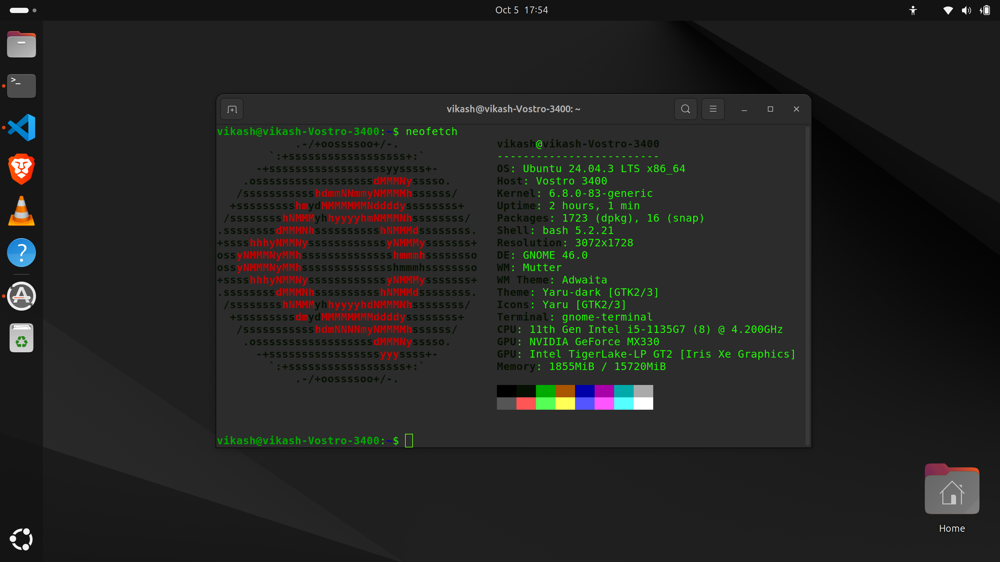
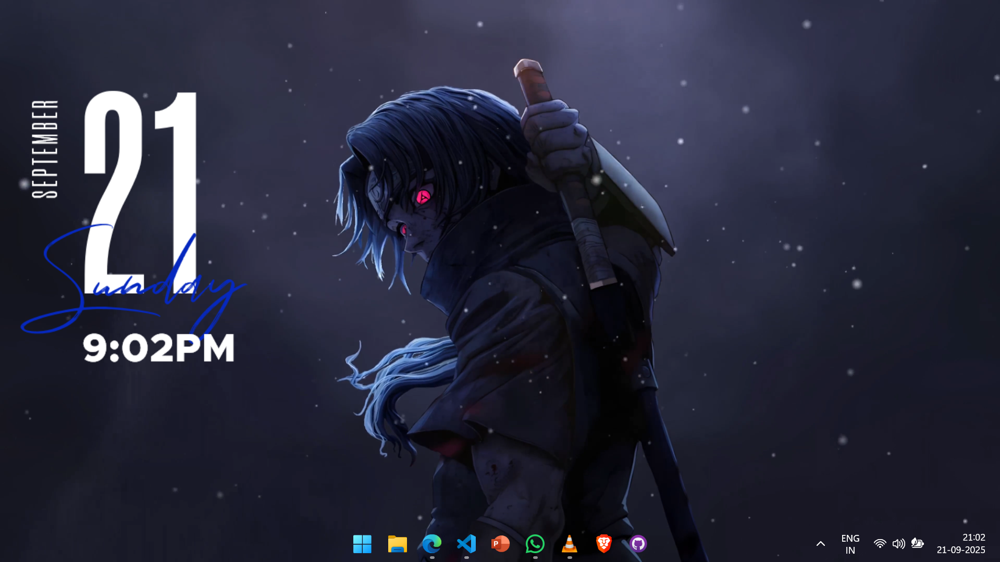

<!-- Animated Header with Gradient Text -->
<h1 align="center">
  

  <!-- Typing animation -->
  
</h1>

---

### 🚀 About Me

I'm a passionate second-year Computer Science student from West Bengal, India, specializing in front-end web development and UI design. I love creating beautiful, functional interfaces and contributing to open-source projects.

<table>
<tr>
<td>
- 🌱 Currently mastering: <b>BlockChain !!</b> 
- 💡 Interests: <b>Operating System</b> 
- 🯠Goals: <b>Build impactful projects and collaborate with developers worldwide</b> 
- ⚡ Fun fact: <b>I enjoy bowling and often use it as a metaphor for coding - aim, adjust, and strike!</b> 
- 🥇 <b>CodeFlow 2K25</b>  
- 🌠Projects blending software & AI  
- 🗃️ Total Repositories: 🔓31 Public, 🔒14 Private
</td>
<td>

</td>
</tr>
</table>

  
Current OS

  

  
Ubuntu

  

  
Windows

  

---

## 🧠 Notable Builds

  
🌾 Pragati Path

  
  AI crop advisor with image disease detection & multilingual chatbot.  
   
  

  
💥 Código / CodeBattle

  
  Live 1v1 code duel platform with real-time leaderboard & AI hints.  
   
  

  
🤠Alpha Chat

  
  Live chat for devs with code snippet sharing + filters.  
   
  

  
👥 Alpha Coders

  
  Team showcase, AI code helper, & dev chatroom.  
   
  

---

<!-- ## 🏆 Hackathon Achievements  

  

 -->

<!-- --- -->

### 🛠️ Tech Stack

#### Programming Languages
 

#### Dev !!

  

<!-- #### ☁️ Deployment

  
  

 -->

---

### 📜 Certifications

  
📠View Certifications

  

    
    
    
    
    
    
    
  

---

### 🧠 Competitive Programming

  
  

---

### 🤝 Connect With Me

  
  
  
  

---

### ☕ Support Me

  

---

### 📊 GitHub Stats

  <!-- GitHub Stats -->
  <picture>
    <source media="(prefers-color-scheme: dark)" srcset="https://github-readme-stats.vercel.app/api?username=Vortex-16&show_icons=true&count_private=true&hide_border=true&bg_color=000000&title_color=00e7ff&text_color=ffffff&icon_color=00e7ff">
    <source media="(prefers-color-scheme: light)" srcset="https://github-readme-stats.vercel.app/api?username=Vortex-16&show_icons=true&theme=default&hide_border=true">
    
  </picture>

  <!-- Streak Stats -->
  <picture>
    <source media="(prefers-color-scheme: dark)" srcset="https://streak-stats.demolab.com/?user=Vortex-16&include_all_commits=true&hide_border=true&background=000000&ring=00e7ff&fire=00e7ff&currStreakNum=ffffff&currStreakLabel=00e7ff&sideNums=ffffff&sideLabels=ffffff&dates=ffffff&stroke=ffffff&card_width=495">
    <source media="(prefers-color-scheme: light)" srcset="https://streak-stats.demolab.com/?user=Vortex-16&theme=default&hide_border=true">
    
  </picture>

  <!-- Top Languages -->
  <picture>
    <source media="(prefers-color-scheme: dark)" srcset="https://github-readme-stats.vercel.app/api/top-langs/?username=Vortex-16&layout=compact&hide_border=true&bg_color=000000&title_color=00e7ff&text_color=ffffff&icon_color=00e7ff&rand=20250829">
    <source media="(prefers-color-scheme: light)" srcset="https://github-readme-stats.vercel.app/api/top-langs/?username=Vortex-16&layout=compact&theme=default&hide_border=true">
    
  </picture>

  <!-- Activity Graph -->
  <picture>
    <source media="(prefers-color-scheme: dark)" srcset="https://github-readme-activity-graph.vercel.app/graph?username=Vortex-16&theme=github-dark&hide_border=true&area=true&bg_color=1a1a1a">
    <source media="(prefers-color-scheme: light)" srcset="https://github-readme-activity-graph.vercel.app/graph?username=Vortex-16&theme=github-light&hide_border=true&area=true">
    
  </picture>

---

### 🏆 GitHub Trophies

<picture>
  <source media="(prefers-color-scheme: dark)" srcset="https://github-profile-trophy.vercel.app/?username=Vortex-16&theme=onedark&margin-w=10&margin-h=10">
  <source media="(prefers-color-scheme: light)" srcset="https://github-profile-trophy.vercel.app/?username=Vortex-16&theme=flat&margin-w=10&margin-h=10">
  
</picture>

---

📧 **Team Contact:** [alpha4coders@gmail.com](mailto:alpha4coders@gmail.com)  
📸 [Instagram – @alphacodersstcet](https://www.instagram.com/alphacodersstcet/)

---

### 🐍 Contribution Snake

  <a href="https://github.com/Platane/snk">
    <picture>
      <source media="(prefers-color-scheme: dark)" srcset="https://raw.githubusercontent.com/Vortex-16/Vortex-16/output/github-snake-dark.svg" />
      <source media="(prefers-color-scheme: light)" srcset="https://raw.githubusercontent.com/Vortex-16/Vortex-16/output/github-snake.svg" />
      
    </picture>
  </a>

---

  

